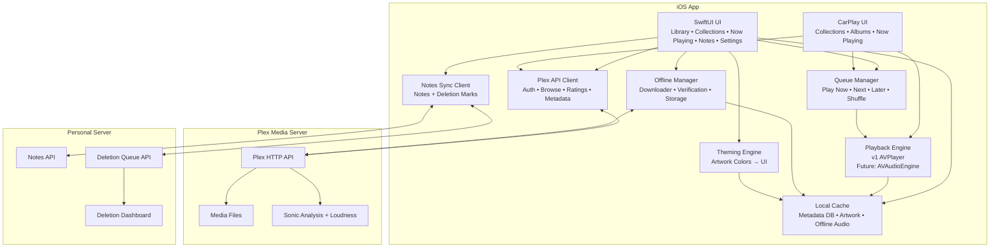

# Lunara: A Personal Plex Music Client

## Purpose

This app is a personal iOS music player built around a Plex music library.
It is designed primarily for rediscovery, emotional context listening, and curated album experiences rather than traditional track-centric streaming behavior.

Plex is the authoritative media library.
This app is a specialized client that reads Plex metadata, plays audio reliably, layers personal context on top, and supports deliberate library curation.

This is not meant to be a general Plex client or a Plexamp replacement.
It is intentionally tailored to a single user’s listening habits.

## Next todo: 

- Implement 1.1.

---

# Core Philosophy

## The Library as a Pool

The music library is treated as a pool:

* Something to jump into rather than browse linearly.
* A place where music should surface unexpectedly.
* A curated environment where rediscovery is as valuable as new discovery.

Shuffle is therefore not a secondary feature — it is a primary interaction model.

---

## Albums as the Primary Unit

This app treats albums as the canonical musical object.

Track-level interaction exists, but:

* discovery
* playback context
* notes
* theming
* collections
* deletion decisions

all revolve around albums first.

---

## Plex as Source of Truth

Plex remains the authoritative system for:

* library structure
* album metadata
* ratings
* artwork
* audio files

This app:

* reads Plex metadata
* writes star ratings back to Plex (online only)
* never deletes media files
* never modifies Plex library structure except ratings

Personal contextual data (notes, deletion marks, vibe classification) lives outside Plex on a personal server.

---

# Core Feature Areas

## Playback Reliability (Highest Priority)

### Requirements

* Never treat partially cached audio as complete.
* Offline playback only uses fully downloaded verified files.
* If offline and a track is not downloaded → skip immediately.
* Network interruptions should degrade gracefully, never silently truncate playback.

### Implementation Constraints

Downloaded audio must:

* complete fully before marked offline-ready
* pass size/consistency validation
* never be replaced by transient streaming cache.

---

## Playback Modes

### Supported Modes

1. Album Playback

   * sequential tracks
   * gapless playback preferred

2. Collection Shuffle (Primary Mode)

   * tracks shuffled across albums in a collection
   * unbiased shuffle with anti-annoyance constraints

3. Whole Library Shuffle

   * uniform shuffle across entire library

---

## Shuffle Constraints (Anti-Annoyance Rules)

Shuffle intentionally avoids mathematically pure randomness.

Constraints:

* No same artist within last 3 tracks
* No back-to-back tracks from the same album
* Otherwise uniform selection

Queue is finite but large (~500 tracks default).

---

## Queue Behavior

Queue supports album-level insertion:

* Play now
* Play next
* Play later

Queue persists across app restarts.

---

## Offline Collections

### Downloaded Collections

Collections defined in Plex can be marked “Downloaded.”

Behavior:

* All albums in that collection sync locally.
* Albums added to the collection auto-download.
* Albums removed auto-delete locally only when no other downloaded collection references them.

Reference counting across collections prevents accidental deletion.

---

## Storage Management

User-configurable storage cap:

* Defined in app settings.
* Pinned collections never evict automatically.
* Non-pinned cached audio may evict under storage pressure.

Auto-redownload of changed albums:

* Wi-Fi only.
* Triggered by metadata change detection.

---

## Detecting Album Changes (Plex Strategy)

Because Plex has no single canonical update timestamp:

Detection uses combined signals:

* recently updated metadata queries
* track count differences
* duration differences
* artwork changes
* periodic full reconciliation

This ensures offline cache integrity.

---

## Playback Engine Strategy

### Initial Engine

* AVPlayer-based playback.
* Modular architecture to enable future replacement.

### Future Target

Transition toward an audio-engine pipeline enabling:

* loudness leveling
* gapless playback improvements
* smart crossfade transitions
* sonic-analysis-informed transitions

Playback engine must remain abstracted behind an internal interface.

---

## Loudness Leveling & Sonic Features

Goals:

* consistent perceived loudness
* smooth shuffle transitions
* eventual Plex sonic-analysis utilization

Initial phase:

* loudness normalization
* basic crossfade

Later phase:

* Plexamp-style smart transitions.

---

## CarPlay Integration (Early Priority)

Supported:

* browse collections
* shuffle collection
* browse albums within collections
* play album
* now playing controls

Deferred:

* search
* notes entry
* metadata editing

CarPlay focuses on safe, predictable listening flows.

---

## Metadata Editing

### Supported Initially

* Star rating edits (online only)
* Writes back to Plex

### Deferred

* mood/style editing
* genre edits
* artwork edits

These may be implemented later if Plex APIs allow stable write-back.

---

## Personal Notes System

Stored on a personal API, not Plex.

### Session Notes Structure

```
AlbumSessionNote:
  plex_album_id
  session_date
  optional rating_snapshot
  freeform notes
```

Notes:

* tied to albums only
* not mirrored into Plex
* synced across devices via personal server.

---

## Visual Theming — Memory-Responsive Listening Environments

Visual theming in this app is not purely decorative.  
It exists to reinforce the emotional, historical, and contextual relationship between the listener and their music library.

The goal is to create a listening environment that reflects not just the album being played, but the personal associations, eras, and aesthetic context tied to that music.

### Theme Priority Layers

Themes resolve using a clear hierarchy:

1. Personal Memory Theme (highest priority)
2. Era/Genre Aesthetic Theme
3. Automatic Artwork-Derived Theme (fallback)

This ensures every album has a coherent visual environment while allowing deeper personalization where desired.

---

### Automatic Artwork-Derived Themes

Default behavior derives visual styling from album artwork:

- dominant color extraction
- gradient generation
- subtle background textures
- restrained motion/animation

This guarantees visual cohesion without requiring manual setup.

---

### Era / Genre Aesthetic Themes

Certain music styles evoke recognizable visual aesthetics.  
These can optionally influence UI presentation.

Examples:

- 90s alt / nu metal → grunge textures, nostalgic media-player skin vibes
- 80s electronic → neon grids, retro digital styling
- indie pop → clean pastel minimalism
- lo-fi / ambient → subdued motion, soft grain
- classical → restrained typography and minimal visuals

These themes should remain subtle and never interfere with usability.

They are rule-based initially (metadata-driven), not ML-driven.

---

### Personal Memory Themes

Users can optionally attach personal imagery or visual context to albums.

Examples:

- concert photos
- friend groups or life-era photos
- locations tied to listening memories
- nostalgic media player skins or visual callbacks
- personally meaningful artwork

These themes override automatic styling when present.

They are stored on the personal server alongside session notes and are never written back to Plex.

---

### Design Guardrails

Themes must:

- never distract from playback controls
- avoid heavy animation during active listening
- keep album artwork primary
- preserve readability at all times
- degrade gracefully on CarPlay (where theming is minimal)

Music remains the primary experience; theming provides context, not spectacle.

---

### Future Direction (Non-Blocking)

Potential future enhancements include:

- context-aware theming (time of day, activity, listening patterns)
- session-note-informed aesthetic adjustments
- resurfacing historical themes tied to past listening eras

These are exploratory and not required for initial implementation.

---

# Discovery System Vision

## Album Zones

Albums naturally cluster into evolving categories:

### Current Vibes

Albums strongly resonating recently.

### Key Albums

Albums with lasting emotional or personal significance.

### Emerging Interests

Albums recently discovered or not deeply explored.

These zones guide discovery weighting but do not override shuffle randomness.

---

## Context-Aware Listening (Long-Term Goal)

The app should eventually support:

* mood-aligned playback
* situational listening (work, exercise, reflection)
* resurfacing meaningful albums from the library.

This is not a recommendation engine for new music.
It is rediscovery within a curated personal collection.

---

# Library Curation: Marked for Deletion

## Goal

Support deliberate pruning of the music library without letting the app delete media.

The app:

* marks albums for deletion
* syncs this list to a personal server
* automatically clears items when Plex no longer contains them.

---

## Workflow

### In App

* “Mark for deletion” action on album.
* Albums appear in a dedicated “Ready to Delete” list.
* Optional reason notes allowed.

When marked:

* automatically removed from downloaded collections.

---

### On Personal Server

Provide a simple web view:

* browse albums marked for deletion
* use as reference while manually deleting files from storage.

---

## Automatic Clearing

When Plex library refresh shows an album missing:

* remove it from deletion list automatically.

Fallback matching uses:

* artist/title/year if Plex ID changes.

---

## Safety Principles

* App never deletes media.
* Plex remains authoritative.
* Manual deletion happens outside the app.

---

# Identity Strategy

Album identification uses:

* Plex album `ratingKey` primarily.
* Fallback matching:

  * artist
  * album title
  * year

Required for:

* notes syncing
* deletion tracking
* offline reconciliation.

---

# Settings Page Requirements

Must include:

* offline storage limit
* Wi-Fi-only downloads toggle
* loudness leveling toggle
* transition/crossfade toggle
* notes API configuration
* sync status diagnostics.

---

# Explicit Non-Goals (Current Scope)

* playlist editing
* multi-server abstraction
* podcast/audiobook support
* social features
* desktop client
* fully general Plex client parity.

---

# Major Technical Risks

1. Plex metadata update detection consistency.
2. Seamless transition implementation complexity.
3. Offline sync correctness across library changes.
4. Plex API variability across server versions.
5. CarPlay UX constraints.

---

# Implementation Philosophy

This is a personal tool.

Optimization priorities:

1. Listening joy
2. Rediscovery
3. Reliability
4. Emotional context
5. Performance

Broad market appeal is not a goal.

--- 

# Architecture Diagrams


